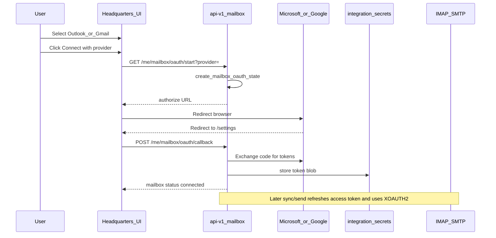

# Mailbox OAuth for Outlook and Gmail

**Status:** Planned (not implemented)  
**Branch target:** `dev`

## Overview

Add one-click OAuth connect for Outlook/Microsoft 365 and Gmail in Mail settings, storing refresh tokens and authenticating IMAP/SMTP via XOAUTH2—mirroring the existing Google Calendar OAuth flow—so Modern Auth works without app passwords.

## Diagnosis

Mail settings today only collect a password/app password and the edge clients use basic `LOGIN` / `AUTH LOGIN`:

- UI: [`src/lib/components/crm/profile-mailbox-form.svelte`](../src/lib/components/crm/profile-mailbox-form.svelte) — Provider preset only fills hosts; password field always shown
- IMAP probe/sync: [`supabase/functions/_shared/imap-inbound.ts`](functions/_shared/imap-inbound.ts) — `LOGIN user pass`
- SMTP send: [`supabase/functions/_shared/smtp-outbound.ts`](functions/_shared/smtp-outbound.ts) — `AUTH LOGIN`
- Microsoft docs require **Modern Auth / OAuth2** for Outlook.com / Microsoft 365 ([POP/IMAP/SMTP settings](https://support.microsoft.com/en-US/Outlook/pop-imap-and-smtp-settings-for-outlook-com), [OAuth for IMAP/SMTP](https://learn.microsoft.com/en-us/exchange/client-developer/legacy-protocols/how-to-authenticate-an-imap-pop-smtp-application-by-using-oauth))

There is **no mailbox OAuth** today. The closest reusable pattern is **Google Calendar**: start → provider redirect → callback → vault token blob → never echo secrets ([`functions/api-v1/calendar.ts`](functions/api-v1/calendar.ts), [`functions/_shared/google-calendar.ts`](functions/_shared/google-calendar.ts), [`src/lib/components/crm/profile-calendar-form.svelte`](../src/lib/components/crm/profile-calendar-form.svelte)).

## Chosen approach

**IMAP/SMTP + SASL XOAUTH2** (not Microsoft Graph / Gmail REST rewrite).

Why: keeps the existing sync/inbox/thread pipeline and vault model; only auth changes. User-delegated OAuth (authorization code + refresh token) matches “click button → SSO → return to Headquarters.”

Scope for this work: **Outlook/Microsoft 365 and Gmail**. Custom IMAP/SMTP stays password-based.

## Data model

Extend `mailbox_accounts` (migration):

- `auth_mode` — `password` | `oauth` (default `password`)
- `oauth_provider` — `microsoft` | `google` | null
- Keep `secret_ref`: for OAuth store a JSON token blob (same pattern as calendar: `refresh_token`, `access_token`, `expiry`, `account_email`) instead of a plaintext password
- Add `private.mailbox_oauth_states` + RPCs `create_mailbox_oauth_state` / `consume_mailbox_oauth_state` (TTL ~10m), mirrored from calendar

Update credential RPCs so sync/test/send return either `{ auth_mode: 'password', password }` or `{ auth_mode: 'oauth', token_blob, username/email }` — service_role only, never echoed to clients.

## Backend (edge)

### New shared modules

- `supabase/functions/_shared/mailbox-oauth.ts` — build auth URLs, exchange codes, refresh tokens for Microsoft and Google; serialize/parse token blobs; build XOAUTH2 SASL string (`base64(user=…\x01auth=Bearer …\x01\x01)`)
- Extend `imap-inbound.ts` and `smtp-outbound.ts` to accept `auth: { type: 'password' | 'xoauth2', … }` and issue `AUTHENTICATE XOAUTH2` / SMTP `AUTH XOAUTH2` when OAuth

### Microsoft

- Auth: `https://login.microsoftonline.com/common/oauth2/v2.0/authorize` (+ token endpoint)
- Scopes: `offline_access`, `openid`, `email`, `https://outlook.office.com/IMAP.AccessAsUser.All`, `https://outlook.office.com/SMTP.Send`
- After connect, force known hosts (align SMTP with Microsoft docs: `smtp-mail.outlook.com:587` STARTTLS; IMAP `outlook.office365.com:993` TLS)

### Google

- Auth: Google OAuth authorize + token endpoints (separate client from Calendar — different scopes)
- Scope: `https://mail.google.com/` (required for IMAP/SMTP XOAUTH2) + `email` / `openid`
- Hosts: existing Gmail preset (`imap.gmail.com` / `smtp.gmail.com`)

### API routes

In `supabase/functions/api-v1/mailbox.ts`:

| Route | Behavior |
|-------|----------|
| `GET /api/v1/me/mailbox/oauth/start?provider=microsoft\|google` | Create state, return authorize URL |
| `GET\|POST /api/v1/me/mailbox/oauth/callback` | Consume state, exchange code, upsert mailbox with OAuth secret + preset hosts, return public status |
| Existing `test` / `sync` / SMTP send paths | Refresh access token if needed, persist updated blob, auth via XOAUTH2 |

Include a staging stub mode (like calendar) so CI can complete the flow without live IdPs.

### Env vars

Document in `.env.example` + edge secrets:

- `MICROSOFT_MAILBOX_CLIENT_ID` / `_SECRET` / `_REDIRECT_URI`
- `GOOGLE_MAILBOX_CLIENT_ID` / `_SECRET` / `_REDIRECT_URI`

Separate from Supabase Auth Azure/Google login and from `GOOGLE_CALENDAR_*`.

## Frontend UX

In `src/lib/components/crm/profile-mailbox-form.svelte`:

- When preset is **Outlook / Microsoft 365** or **Gmail**: show a primary **Connect with Microsoft** / **Connect with Google** button (same spirit as Calendar’s connect button)
- Hide password + manual host grids for those presets when using OAuth; **Outlook will be OAuth-only** since basic auth is effectively dead
- When already connected via OAuth: show connected email, last-checked, Test / Sync / Disconnect — no password field
- **Custom** preset: keep today’s full IMAP/SMTP password form unchanged

Wire in `src/lib/components/crm/personal-settings-controller.svelte`:

- `onConnectMailboxOAuth(provider)` → `api.mailbox.startOAuth(provider)` → `window.location.assign(url)` (same as calendar)
- On return to `/settings#mail`, detect callback query params (or a dedicated thin callback route that posts then redirects) → `api.mailbox.completeOAuth` → reload mailbox status
- Client API in `src/lib/api/v1/endpoints/mailbox.ts`; extend `MailboxAccountResource` in `src/lib/schemas/mailbox.ts` with `auth_mode` + `oauth_provider`

Copy updates: replace “check password / app password” messaging for OAuth auth failures with “reconnect your Microsoft/Google account.”

## Operator setup (required outside code)

1. **Azure app registration** — public/web redirect URI = mailbox callback; add delegated IMAP + SMTP.Send permissions; enable multi-tenant or single-tenant as needed
2. **Google Cloud OAuth client** — redirect URI for mailbox callback; enable Gmail API / mail scope; verify if publishing beyond test users
3. Users may still need IMAP enabled in Outlook.com settings ([enable POP/IMAP](https://support.microsoft.com/en-US/Outlook/pop-imap-and-smtp-settings-for-outlook-com))

## Implementation todos

1. Migration: `auth_mode`, `oauth_provider`, `mailbox_oauth_states` + upsert/credential RPCs
2. Shared mailbox-oauth module (Microsoft + Google authorize/exchange/refresh + XOAUTH2)
3. Extend IMAP/SMTP clients for XOAUTH2; refresh tokens on test/sync/send
4. Add `/me/mailbox/oauth/start` and `/callback`; stub mode; env vars
5. Mail settings: Connect with Microsoft/Google button; callback return; hide password for OAuth presets
6. Tests + `.env.example` + operator setup notes for Azure/Google apps

## Tests

- Unit: XOAUTH2 string encoding; token refresh; secret-echo guards for token blobs
- API/http tests: oauth start/callback stub path; password path still works for custom
- IMAP/SMTP auth branch unit tests with mocked sockets where existing patterns allow
- UI: preset Outlook shows Connect button, not password field

## Out of scope

- Rewriting sync onto Microsoft Graph or Gmail REST
- Org-level “send as” / shared mailboxes
- Changing Supabase Auth Google/Azure login clients
- Yahoo or other OAuth providers
